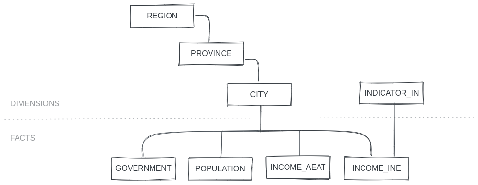

# Data collect load
Application to get, clean, order and load several and different data to db.

Create entities with relationships between each others and a normalized star model in db.

At this pilot version you can get information about:

- Population every city in Spain by [INE](https://www.ine.es/).
    - By gender.
    - By age.
- Income every city in Spain by [INE](https://www.ine.es/) and by [AEAT](https://sede.agenciatributaria.gob.es/).
- Government every city by [Ministerio política territorial](https://www.mptfp.gob.es/) and every region by [wikipedia](https://es.wikipedia.org/wiki/Anexo:Presidencias_de_las_comunidades_aut%C3%B3nomas_espa%C3%B1olas).

Current entities:


You can get this data using the microservice [collect API REST](https://github.com/elvestevez/collect_api). Check available endpoints in its doc!

In addition, it's available web app [collect streamlit](https://github.com/elvestevez/collect_streamlit) to get data more friendly.

### **Technology stack**
Python, SQL, Pandas, Beautifulsoup, Selenium.

### **Configuration**
Get project from GitHub and create a python environment with these additional libraries:
- sqlalchemy
- pandas
- beautifulsoup
- selenium

> Review requirements.txt file.

To use selenium, don't forget upgrade your driver chrome, if it's required (path = ../../drivers/chromedriver).

### **Usage**
To run the application you have to open in a terminal the file load_db.py. 

Example:

`python load_db.py`

> Some necessary files to load aren't available at git hub project.

### **Folder structure**

```
└── project
    ├── .gitignore
    ├── README.md
    ├── requirements.txt
    ├── load_db.py
    ├── db
    └── modules
        ├── db
        ├── get
        └── load
```

---

### **Next steps**
- Other technologies on cloud (Azure, AWS...), included db.
- Automize the downloads of information.
- Schedule execution to load new data.
- Check the information with the source and update data if any change is detected (shchedule).
- Add new information to extend analysis areas.
